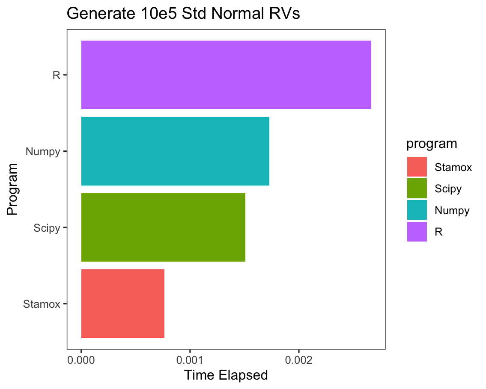

<h1 align='center'>Stamox</h1>

[](https://badge.fury.io/py/stamox)
[](https://pypi.org/project/stamox/)
[](https://pypi.org/project/stamox/)
[]()

# Hello Stamox, Why Another Wheel?


# Why Another Wheel?

What stamox does is really simple, just make it possible, it aims to provide a statistic interface for `JAX`. But nowadays, we have so many statistic packages around the world varying from languages, for python, `statsmodels` just works great, for `R`, `tidyverse` derived packages are so delicate and easy to use. So **why build another wheel**?

Three reasons I think:

* Personal interest, as a student of statistics, I want to learn more about statistics and machine learning, proficient knowledge comes from books but more from practice, write down the code behind the theory is a good way to learn.

* Speed, `JAX` is really fast, and `Equinox` is a good tool to make `JAX` more convenient, backend of `JAX` is `XLA`, which makes it possible to compile the code to GPU or TPU, and it is really fast.

* Easy of Use, `%>%` is delicate operation in `R`, it combines the functions to a pipe and make the code more readable, and `stamox` is inspired by it, and I want to take a try to make it convenient in python with `>>`.

And here're few benchmarks:

*generate random variables*



*calculate cdf*


## Installation

```bash
pip install -U stamox
# or
pip install git+[stamox](https://github.com/JiaYaobo/stamox.git)
```

## Documentation

More comprehensive introduction and examples can be found in the [documentation](https://jiayaobo.github.io/stamox/).

## Quick Start

### Similar but faster distribution functions to `R`

You can simply import all functions from `stamox.functions`

```python
from stamox.functions import dnorm, pnorm, qnorm, rnorm
import jax.random as jrandom

key = jrandom.PRNGKey(20010813)

# random
x = rnorm(key, sample_shape=(1000, ))
# cdf
prob = pnorm(x)
# ppf
qntl = qnorm(prob)
# pdf
dnorm(x)
```

### Fearless Pipeable

`>>` is the pipe operator, which is the similar to `|>` in `F#` and `Elixir` or `%>%` in `R`.

* You can simply import all pipeable functions from `pipe_functions`

```python
import jax.random as jrandom
import stamox.pipe_functions as PF
from stamox import pipe_jit

key = jrandom.PRNGKey(20010813)

@pipe_jit
def f(x):
    return [3 * x[:, 0] + 2 * x[:, 1] - x[:, 2], x] # [y, X]
pipe = PF.rnorm(sample_shape=(1000, 3)) >> f >> PF.lm
state = pipe(key)
print(state.params)
```

### Linear Regression with Formula

```python
import pandas as pd
import numpy as np
from stamox.functions import lm # or from stamox.pipe_functions import lm


x = np.random.uniform(size=(1000, 3))
y = 2 * x[:,0] + 3 * x[:,1] + 4 * x[:,2] + np.random.normal(size=1000)
df = pd.DataFrame(x, columns=['x1', 'x2', 'x3'])
df['y'] = y

lm(df, 'y~x1+x2+x3').params
```

* Custom Functions Pipeable

```python
from stamox import make_pipe, make_partial_pipe, Pipeable
import jax.numpy as jnp
import jax.random as jrandom

x = jnp.ones((1000, ))
# single input, simply add make pipe
@make_pipe
def f(x):
    return x ** 2

# multiple input, decorate with make partial pipe
@make_partial_pipe
def g(x, y):
    return x + y

# x -> f -> g(y=2.) -> f -> g(y=3.) -> f
h = Pipeable(x) >> f >> g(y=2.) >> f >> g(y=3.) >> f
# h is a Pipeable object, you can call it to get the result
print(h())
```

* Compatible With `JAX` and `Equinox`

You can use autograd features from `JAX` and `Equinox` with `Stamox` easily.

```python
import jax.numpy as jnp
from stamox import make_partial_pipe
from equinox import filter_jit, filter_vmap, filter_grad

@make_partial_pipe
@filter_jit
@filter_vmap
@filter_grad
def f(x, y):
    return y * x ** 3

# df/dx = 3y * x^2
g = f(y=3.) # derive with respect to x given y=3
g(jnp.array([1., 2., 3.]))
```

Or vmap, pmap, jit features integrated with `Stamox`:

```python
from stamox import pipe_vmap, pipe_jit

@pipe_vmap
@pipe_jit
def f(x):
    return x ** 2

g = f >> f >> f
print(g(jnp.array([1, 2, 3])))
```

## Acceleration Support

`JAX` can be accelerated by `GPU` and `TPU`. So, `Stamox` is compatible with them.

## See More

[JAX](https://github.com/google/jax)

[Equinox](https://github.com/patrick-kidger/equinox#readme)